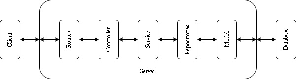

<details>
  <summary>Table of Contents</summary>
  <ol>
    <li>
      <a href="#database-structure">Database Structure</a>
    </li>
    <li>
      <a href="#api-structure">API Structure</a>
    </li>
    <li>
      <a href="#api-request-and-response">API Request and Response</a>
    </li>
    <li>
      <a href="#how-to-run">How to Run</a>
    </li>
  </ol>
</details>

# Database Structure

## Video

| Field             | Type            | Required | Default | Ref     |
| ----------------- | --------------- | -------- | ------- | ------- |
| \_id              | ObjectId        |          |         |         |
| urlImageThumbnail | String          | Yes      |         |         |
| comments          | Array(Comment)  |          |         |         |
| productIds        | Array(ObjectId) |          |         | Product |

## Comment

| Field     | Type   | Required | Default                       | Ref |
| --------- | ------ | -------- | ----------------------------- | --- |
| username  | String | Yes      |                               |     |
| comment   | String | Yes      |                               |     |
| createdAt | Number |          | Math.floor(Date.now() / 1000) |     |

## Product

| Field | Type     | Required | Default | Ref |
| ----- | -------- | -------- | ------- | --- |
| \_id  | ObjectId |          |         |     |
| title | String   | Yes      |         |     |
| price | Number   | Yes      |         |     |
| url   | String   | Yes      |         |     |

# API Structure



# API Request and Response

## **GET /video/thumbnail**

Returns all video thumbnail

- **URL Params**  
  None
- **Data Params**  
  None
- **Headers**  
  Content-Type: application/json
- **Success Response:**
- **Code:** 200  
  **Content:**
  ```
  {
    "status": "success",
    "data": [{
      video_id: ObjectId,
      url_image_thumbnail: String,
    }]
  }
  ```
- **Error Response:**
  - **Code:** 500  
    **Content:**
    ```
    {
      "status": "success",
      "message": "something wrong from our side"
    }
    ```

# How to Run
